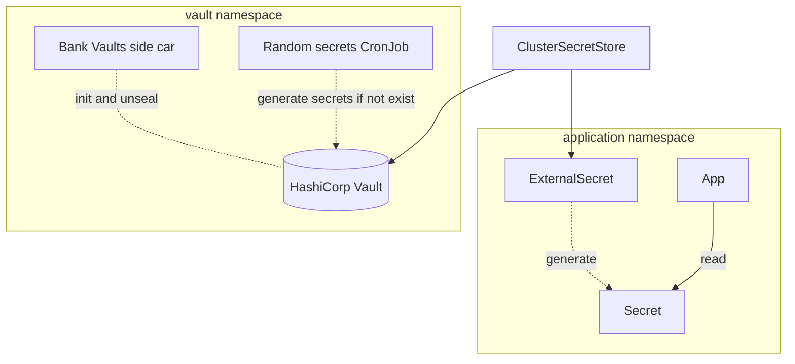

# Secrets management

- Secrets are stored in [HashiCorp Vault](https://www.vaultproject.io)
- Vault is managed with [Vault Operator (Bank Vaults)](https://banzaicloud.com/docs/bank-vaults/operator), automatically initialize and unseal
- Secrets that can be generated are automatically generated and stored in Vault.
- Integrate with GitOps using [External Secrets Operator](https://external-secrets.io)

!!! info

    Despite the name _External_ Secrets Operator, our Vault is deployed on the same cluster.
    HashiCorp Vault can be replaced with AWS Secret Manager, Google Cloud Secret Manager, Azure Key Vault, etc.

TODO: more details on how to use secrets
