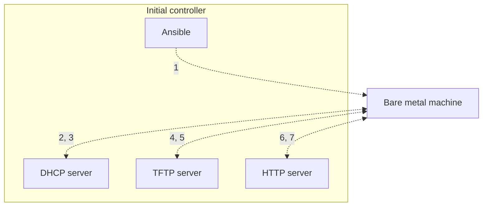

# PXE boot

1. Ansible: Hey MAC address `xx:xx:xx:xx:xx:xx`, wake up!
2. Machine: Hello everyone, I just woke up in network mode, could someone please show me how to boot?
3. DHCP server: I hear you, here's your IP address, proceed to the next server to obtain your bootloader.
4. Machine: Hello, could you please send me my bootloader?
5. TFTP server: Here you go. Grab your boot configuration, kernel, and initial ramdisk as well.
6. Machine: Hi, I just booted into my bootloader, and my boot parameters instructed me to get the installation instructions, packages, etc. from this site.
7. HTTP server: It's all yours.
8. Machine: Great, now I can install the OS and reboot!

Here's how it looks like in action:

<iframe width="560" height="315" src="https://www.youtube-nocookie.com/embed/y-d7btNNAT8" title="YouTube video player" frameborder="0" allow="accelerometer; autoplay; clipboard-write; encrypted-media; gyroscope; picture-in-picture" allowfullscreen></iframe>
