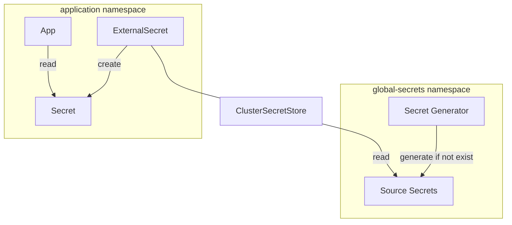

# Secrets management

## Overview

- Global secrets are stored in the `global-secrets` namespace.
- Integrate with GitOps using [External Secrets Operator](https://external-secrets.io).
- Secrets that can be generated are automatically generated and stored in the `global-secrets` namespace.

!!! info

    Despite the name _External_ Secrets Operator, global secrets are created in the same cluster and synced
    to other namespaces using the [Kubernetes provider](https://external-secrets.io/latest/provider/kubernetes).

    While not supported by default in this project, you can also use other external providers such as HashiCorp Vault,
    AWS Secret Manager, Google Cloud Secret Manager, Azure Key Vault, 1Password, etc.



## Randomly generated secrets

This is useful when you want to generate random secrets like admin password and store in global secrets.

```yaml title="./platform/global-secrets/files/secret-generator/config.yaml" hl_lines="2-6"
--8<--
./platform/global-secrets/files/secret-generator/config.yaml
--8<--
```

## Extra third-party secrets

For third-party secrets that you don't control, add them to `external/terraform.tfvars` under the `extra_secrets` key,
then run `make external`.

They will be available as a Secret named `external` in the `global-secrets` namespace.
You can use it with `ExternalSecret` just like any other global secret.

## How secrets are pulled from global secrets to other namespaces

When you apply an `ExternalSecret` object, for example:

```yaml hl_lines="4 21-23"
apiVersion: external-secrets.io/v1beta1
kind: ExternalSecret
metadata:
  name: gitea-admin-secret
  namespace: gitea
spec:
  data:
  - remoteRef:
      conversionStrategy: Default
      key: gitea.admin
      property: password
    secretKey: password
  refreshInterval: 1h
  secretStoreRef:
    kind: ClusterSecretStore
    name: global-secrets
  target:
    creationPolicy: Owner
    deletionPolicy: Retain
    template:
      data:
        password: '{{ .password }}'
        username: gitea_admin
      engineVersion: v2
```

This will create a corresponding Kubernetes secret:

`kubectl describe secrets -n gitea gitea-admin-secret`

```yaml hl_lines="1 8-11"
Name:         gitea-admin-secret
Namespace:    gitea
Labels:       <none>
Annotations:  reconcile.external-secrets.io/data-hash: <REDACTED>

Type:  Opaque

Data
====
password:  32 bytes
username:  11 bytes
```

Please see the official documentation for more information:

- [External Secrets Operator](https://external-secrets.io)
- [API specification](https://external-secrets.io/latest/spec)
