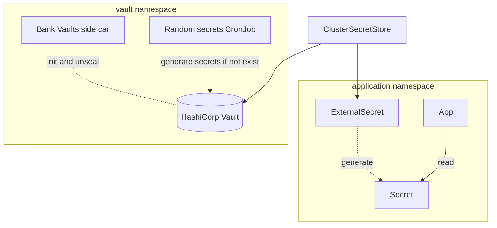

# Secrets management

## Overview

- Secrets are stored in [HashiCorp Vault](https://www.vaultproject.io)
- Vault is managed with [Vault Operator (Bank Vaults)](https://banzaicloud.com/docs/bank-vaults/operator), automatically initialize and unseal
- Secrets that can be generated are automatically generated and stored in Vault.
- Integrate with GitOps using [External Secrets Operator](https://external-secrets.io)

!!! info

    Despite the name _External_ Secrets Operator, our Vault is deployed on the same cluster.
    HashiCorp Vault can be replaced with AWS Secret Manager, Google Cloud Secret Manager, Azure Key Vault, etc.



## Randomly generated secrets

This is useful when you want to generate random secrets like admin password and store in Vault.

```yaml title="./platform/vault/files/generate-secrets/config.yaml" hl_lines="2-6"
--8<--
./platform/vault/files/generate-secrets/config.yaml
--8<--
```

## How secrets are pulled from Vault to Kubernetes

When you apply an `ExternalSecret` object, for example:

```yaml hl_lines="4 21-23"
apiVersion: external-secrets.io/v1beta1
kind: ExternalSecret
metadata:
  name: gitea-admin-secret
  namespace: gitea
spec:
  data:
  - remoteRef:
      conversionStrategy: Default
      key: /gitea/admin
      property: password
    secretKey: password
  refreshInterval: 1h
  secretStoreRef:
    kind: ClusterSecretStore
    name: vault
  target:
    creationPolicy: Owner
    deletionPolicy: Retain
    template:
      data:
        password: '{{ .password }}'
        username: gitea_admin
      engineVersion: v2
```

This will create a corresponding Kubernetes secret:

`kubectl describe secrets -n gitea gitea-admin-secret`

```yaml hl_lines="1 8-11"
Name:         gitea-admin-secret
Namespace:    gitea
Labels:       <none>
Annotations:  reconcile.external-secrets.io/data-hash: <REDACTED>

Type:  Opaque

Data
====
password:  32 bytes
username:  11 bytes
```

Please see the official documentation for more information:

- [External Secrets Operator](https://external-secrets.io)
- [API specification](https://external-secrets.io/latest/spec)
