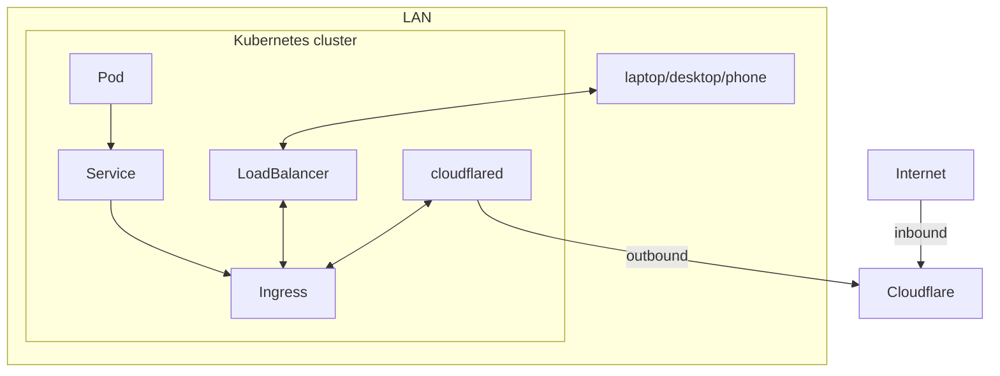

# Networking

```mermaid
flowchart TD
  subgraph LAN
    laptop/desktop/phone <--> LoadBalancer
    subgraph k8s[Kubernetes cluster]
      Pod --> Service
      Service --> Ingress

      LoadBalancer

      cloudflared
      cloudflared <--> Ingress
    end
    LoadBalancer <--> Ingress
  end

  cloudflared -- outbound --> Cloudflare
  Internet -- inbound --> Cloudflare
```

TODO (PR welcomed)
