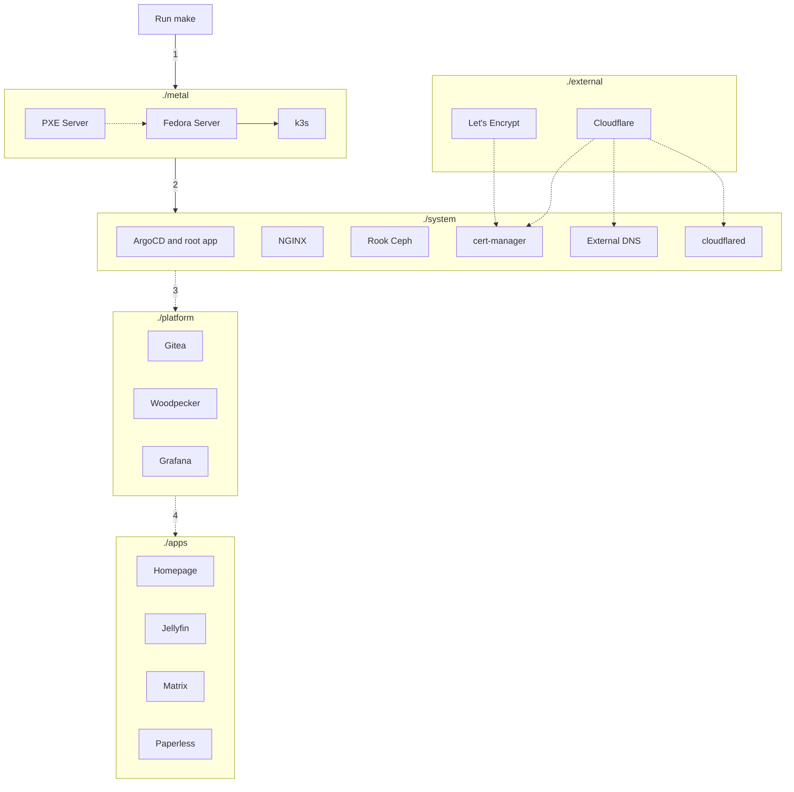

# Overview

## Components

```
+--------------+
|    ./apps    |
|--------------|
|  ./platform  |
|--------------|       +------------+
|   ./system   |- - - -| ./external |
|--------------|       +------------+
|   ./metal    |
|--------------|
|   HARDWARE   |
+--------------+
```

Main components:

- `./metal`: bare metal management, install Linux and Kubernetes
- `./system`: critical system components for the cluster (load balancer, storage, ingress, operation tools...)
- `./platform`: essential components for service hosting platform (git, build runners, dashboards...)
- `./apps`: user facing applications
- `./external` (optional): externally managed services

Support components:

- `./docs`: all documentation go here, this will generate a searchable web UI
- `./scripts`: scripts to automate common tasks

## Provisioning flow

Everything is automated, after you edit the configuration files, you just need to run a single `make` command and it will:

- (1) Build the `./metal` layer:
    - Create an ephemeral, stateless PXE server
    - Install Linux on all servers in parallel
    - Build a Kubernetes cluster (based on k3s)
- (2) Bootstrap the `./system` layer:
    - Install ArgoCD and the root app to manage itself and other layers, from now on ArgoCD will do the rest
    - Install the remaining components (storage, monitoring, etc)
- (3) Build the `./platform` layer (Gitea, Grafana, SSO, etc)
- (4) Deploy applications in the `./apps` layer


